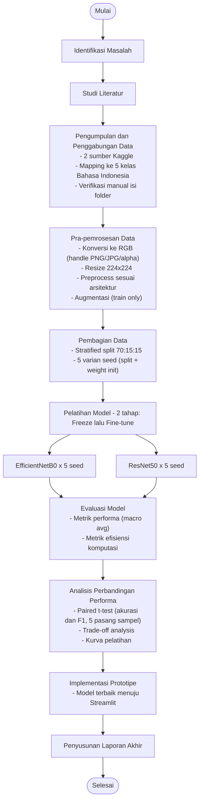

# Dokumentasi Proyek — Klasifikasi Kondisi Cuaca: EfficientNetB0 vs ResNet50

> Dokumen ini adalah dokumentasi teknis utama proyek (bukan bagian dari naskah skripsi). Menjadi *base doc* untuk pengerjaan bertahap bersama Claude Code — scope, alur, tools, dan pembagian fase — dengan referensi seluas mungkin ke Proposal Penelitian yang sudah disetujui (BAB I–III).

## 1. Informasi Umum

| | |
|---|---|
| Judul TA | Analisis Perbandingan Model EfficientNetB0 dan ResNet50 pada Klasifikasi Kondisi Cuaca Berbasis Citra |
| Penulis TA | Mila Lestari (NPM 2208107010002) |
| Program Studi | Informatika, FMIPA, Universitas Syiah Kuala |
| Status akademik | Sudah Seminar Proposal. Revisi 3 dosen penguji (Pak Rasudin, Pak Irvanizam, Bu Kikye) ditangani **setelah** proyek teknis ini selesai — lihat Bagian 8 |
| Dokumen acuan | Proposal Penelitian BAB I–III, khususnya Gambar 3.1 (Alur Metode Penelitian) |

## 2. Ruang Lingkup (Scope)

### 2.1 Termasuk dalam Scope

| # | Item | Ref. Proposal |
|---|---|---|
| 1 | Pengumpulan & penggabungan dataset (2 sumber Kaggle → 5 kelas cuaca) | 3.3.3, Tabel 3.2 |
| 2 | Pra-pemrosesan data (resize, normalisasi, augmentasi) | 3.3.4 |
| 3 | Pembagian data stratified 70:15:15 | 3.3.5, Tabel 3.3 |
| 4 | Pelatihan 2 arsitektur × 5 seed = **10 run pelatihan** | 3.3.6 |
| 5 | Evaluasi model: metrik performa + efisiensi komputasi | 3.3.7, 2.7, 2.8 |
| 6 | Analisis statistik: paired t-test antar arsitektur | 3.3.8 |
| 7 | Implementasi prototipe aplikasi web (Streamlit) | 3.3.9 |
| 8 | Kode sumber lengkap, reproducible, versioned di Git | — |
| 9 | Draf BAB IV (Hasil dan Pembahasan) dan BAB V (Kesimpulan dan Saran) | — |

### 2.2 Ditangguhkan / Di Luar Dokumen Ini
- Revisi naskah BAB I–III dari ketiga dosen penguji dan perbaikan sitasi — dikerjakan pasca-MVP, tidak memengaruhi desain pipeline (lihat Bagian 8)

## 3. Alur Metode Penelitian (Ref. Gambar 3.1 Proposal)

Sembilan tahapan berikut mengikuti Gambar 3.1 pada proposal dan menjadi acuan struktur pengembangan:

1. Identifikasi Masalah (3.3.1)
2. Studi Literatur (3.3.2)
3. Pengumpulan dan Penggabungan Data (3.3.3)
4. Pra-pemrosesan Data (3.3.4)
5. Pembagian Data (3.3.5)
6. Pelatihan Model — EfficientNetB0 & ResNet50 (3.3.6)
7. Evaluasi Model (3.3.7)
8. Analisis Perbandingan Performa (3.3.8)
9. Implementasi Prototipe Aplikasi — Streamlit (3.3.9)

### Diagram Alur (Activity Diagram Sederhana, notasi mirip UML)



Node oval (start/end) dan rectangle (proses) mengikuti konvensi umum UML Activity Diagram; fork pada tahap Pelatihan Model merepresentasikan dua arsitektur yang dilatih terpisah dengan konfigurasi identik, menyatu kembali di tahap Evaluasi Model — sama seperti Gambar 3.1.

### Pemetaan Tahap → Referensi Proposal → Lokasi Repo

| Tahap | Ref. Proposal | Lokasi Repo |
|---|---|---|
| Identifikasi Masalah | 3.3.1 | — (sudah final di proposal) |
| Studi Literatur | 3.3.2, BAB II | — (sudah final di proposal) |
| Pengumpulan & Penggabungan Data | 3.3.3, Tabel 3.2 | `dataset/`, `notebooks/01_data_preparation.ipynb` |
| Pra-pemrosesan Data | 3.3.4 | `src/data_pipeline.py` |
| Pembagian Data | 3.3.5, Tabel 3.3 | `src/data_pipeline.py`, `dataset/processed/` |
| Pelatihan Model | 3.3.6 | `src/model_builder.py`, `src/train.py`, `notebooks/02_*.ipynb`, `notebooks/03_*.ipynb`, `models/` |
| Evaluasi Model | 3.3.7, 2.7, 2.8 | `src/evaluate.py`, `notebooks/04_evaluation_comparison.ipynb`, `results/` |
| Analisis Perbandingan Performa | 3.3.8 | `results/statistical_test/` |
| Implementasi Prototipe | 3.3.9 | `app/streamlit_app.py` |

## 4. Detail Teknis per Tahap

Bagian ini hanya memuat detail yang **menambah atau menegaskan** keputusan teknis di luar apa yang sudah lengkap dituliskan di proposal — bukan menyalin ulang spesifikasi yang sudah final di sana.

### 4.1 Pengumpulan & Penggabungan Data *(Ref. Proposal 3.3.3, Tabel 3.2)*

Mapping final ke 5 kelas, berdasarkan isi folder dataset yang sudah diunduh:

| Kelas Final | Sumber | Tersedia | Dipakai |
|---|---|---|---|
| Cerah | Source 1 (Taufik) → Cerah | 170 | 170 (semua) |
| Mendung | Source 1 (Taufik) → Mendung | 170 | 170 (semua) |
| Hujan | Source 1 (Taufik) → Hujan | 170 | 170 (semua) |
| Berawan | Source 2 (vijayvkb98) → Cloudy | 323 | 170 (sampling, `random_state=42`) |
| Berkabut | Source 2 (vijayvkb98) → Fog | 259 | 170 (sampling, `random_state=42`) |
| **Total** | | | **850** |

Kelas Rainy, Shine, Sunrise, Sand, Snow pada Source 2 tidak dipakai (tidak relevan / sudah terwakili Source 1), sesuai Proposal 3.3.3.

> **Catatan operasional:** sudah dikonfirmasi ada ketidaksesuaian folder vs label pada dataset sumber. Verifikasi & koreksi ini wajib selesai sebelum proses penggabungan dijalankan — detail teknis penanganannya disusun terpisah di tahap preprocessing, di luar dokumen ini.

### 4.2 Pra-pemrosesan Data *(Ref. Proposal 3.3.4)*

Resize 224×224, `preprocess_input` per-arsitektur, dan augmentasi (train only) mengikuti spesifikasi proposal secara identik.

Tambahan teknis di luar proposal — jawaban langsung untuk revisi Pak Rasudin poin 2 (format gambar): seluruh citra distandarkan ke RGB murni via `PIL.Image.convert("RGB")` sebelum resize, agar campuran format JPG/PNG (termasuk PNG beralpha channel atau mode grayscale/palette) tidak menyebabkan error dimensi channel saat masuk ke `tf.keras.applications.*`.

### 4.3 Pembagian Data *(Ref. Proposal 3.3.5, Tabel 3.3)*

Stratified split 70:15:15 via `train_test_split`, sesuai proposal. Untuk validitas paired t-test (3.3.8), setiap run `i` (i = 1..5) menggunakan:

- `random_state=seed_i` pada `train_test_split` → split data **identik** antara EfficientNetB0 dan ResNet50 di run ke-`i` yang sama
- `tf.random.set_seed(seed_i)` sebelum membangun tiap model → variasi inisialisasi bobot classifier head ikut tercermin

Hasilnya: 5 pasang (EfficientNetB0ᵢ, ResNet50ᵢ) yang valid secara statistik untuk `scipy.stats.ttest_rel`, karena tiap pasang berbagi kondisi data identik namun beda arsitektur.

> **Perlu diputuskan sebelum Fase 2 (Bagian 10):** daftar 5 nilai seed konkret, mis. `[42, 123, 2024, 7, 99]`.

### 4.4 Pelatihan Model *(Ref. Proposal 3.3.6)*

Head klasifikasi, dua tahap freeze/fine-tune, hyperparameter, dan tiga callback mengikuti spesifikasi proposal secara identik — tidak diulang di sini.

Konvensi penamaan checkpoint (keputusan proyek, tidak ada di proposal): `models/{arsitektur}_seed{n}.keras`, mis. `efficientnetb0_seed1.keras`, agar konsisten dilacak lintas 10 run. Strategi checkpoint & deployment: lihat Bagian 6 dan 4.7.

### 4.5 Evaluasi Model *(Ref. Proposal 3.3.7, 2.7, 2.8)*

Metrik performa (macro average) dan metrik efisiensi komputasi dihitung untuk tiap 10 run, sesuai definisi di proposal.

### 4.6 Analisis Perbandingan Performa *(Ref. Proposal 3.3.8)*

Paired t-test pada akurasi & F1-score (5 pasang sampel per metrik), trade-off analysis akurasi vs efisiensi, dan analisis kurva pelatihan — sesuai proposal.

### 4.7 Implementasi Prototipe *(Ref. Proposal 3.3.9)*

Model terbaik secara keseluruhan (lihat Bagian 6 — Strategi Checkpoint) di-deploy ke `app/streamlit_app.py`: upload citra → prediksi kelas cuaca + confidence score.

## 5. Struktur Direktori Proyek

```
TUGAS-AKHIR/
├── app/
│   └── streamlit_app.py
├── dataset/
│   ├── raw/
│   │   ├── source-1-taufik/       # Weather Image Dataset: Sunny, Overcast, Rainy
│   │   └── source-2-vijayvkb98/   # DS Dataset
│   └── processed/                 # hasil penggabungan, 5 kelas, 850 citra
├── doc/
│   └── documentation.md           # dokumen ini
├── models/                        # checkpoint .keras, 1 per (arsitektur, seed)
├── notebooks/
│   ├── 01_data_preparation.ipynb
│   ├── 02_train_efficientnetb0.ipynb
│   ├── 03_train_resnet50.ipynb
│   └── 04_evaluation_comparison.ipynb
├── results/
│   ├── metrics/            # classification report, confusion matrix (csv/json)
│   ├── figures/            # kurva pelatihan, plot confusion matrix
│   └── statistical_test/   # hasil paired t-test
├── src/
│   ├── data_pipeline.py
│   ├── model_builder.py
│   ├── train.py
│   └── evaluate.py
├── README.md
└── requirements.txt
```

## 6. Tools & Environment *(Ref. Proposal 3.2.1, 3.2.2)*

| Komponen | Proposal (formalitas dokumen) | Aktual Dipakai |
|---|---|---|
| OS pengembangan lokal | Windows 11 Pro | Arch Linux |
| Platform training | Google Colaboratory (GPU T4 tunggal) | Kaggle Notebook (GPU T4×2) |
| Python | 3.10.12 | 3.10+ |
| TensorFlow | 2.20.0 | 2.x, kompatibel `tf.keras.applications` |
| NumPy / Pandas / Matplotlib / Seaborn / Scikit-learn | versi spesifik di proposal | sama, versi mengikuti environment Kaggle |
| Pillow (PIL) | 10.4.0 | sama |
| Kaggle API | 1.6.17 | sama |
| Streamlit | 1.38.0 | sama |

Perbedaan OS dan platform training murni formalitas dokumen/infrastruktur eksekusi — tidak mengubah metodologi (arsitektur, hyperparameter, callback tetap identik dengan proposal).

**Strategi GPU T4×2 di Kaggle:** dataset kecil dan model ringan membuat percepatan dual-GPU tidak wajib, namun dimanfaatkan via **paralel manual** — EfficientNetB0 di `GPU:0`, ResNet50 di `GPU:1` berjalan bersamaan per ronde seed (`CUDA_VISIBLE_DEVICES` atau `tf.config.set_visible_devices`), sehingga 10 run selesai dalam waktu ~5 run sekuensial. (`tf.distribute.MirroredStrategy` untuk data-parallel tidak dipakai — manfaatnya kecil untuk dataset sekecil ini.)

**Strategi Checkpoint:** seluruh 10 checkpoint (2 arsitektur × 5 seed) disimpan di `models/` untuk analisis statistik dan reproduktibilitas (`ModelCheckpoint(save_best_only=True)` per run). Untuk aplikasi Streamlit, hanya **satu model terbaik secara keseluruhan** yang di-deploy — konsisten dengan Proposal 3.3.9 ("model terbaik hasil perbandingan diintegrasikan ke dalam prototipe aplikasi").

## 7. Output yang Dihasilkan (Deliverables)

| Output | Lokasi | Ref. |
|---|---|---|
| Dataset final (850 citra, 5 kelas Bahasa Indonesia) | `dataset/processed/` | 4.1 |
| Kode sumber pipeline & training | `src/`, `notebooks/` | 4.2–4.4 |
| 10 model terlatih (.keras) | `models/` | 4.4 |
| Laporan evaluasi (classification report, confusion matrix, kurva) | `results/metrics/`, `results/figures/` | 4.5 |
| Hasil uji statistik (paired t-test) | `results/statistical_test/` | 4.6 |
| Prototipe aplikasi Streamlit | `app/streamlit_app.py` | 4.7 |
| Draf BAB IV & V | `doc/` | Fase 5 (Bagian 10) |

## 8. Revisi Tertunda (Ditangani Pasca-MVP)

**Pak Rasudin**
1. Kerangka argumen trade-off untuk sidang: bagaimana menyimpulkan hasil bila satu model unggul di efisiensi komputasi (mis. jumlah parameter lebih kecil) tapi tidak unggul di metrik performa
2. Klarifikasi bahwa citra yang dipakai adalah foto langit/lingkungan biasa (bukan citra satelit); penjelasan 224×224 sebagai ukuran input standar arsitektur, bukan resolusi asli citra; pembahasan keberagaman format file asli (JPG/PNG) dan penanganannya (sudah diimplementasikan teknis di 4.2, tinggal dinarasikan di naskah)

**Pak Irvanizam**
1. ~~Jumlah & nama kelas~~ — sudah terjawab (5 kelas: Cerah, Mendung, Hujan, Berawan, Berkabut), konsisten Bahasa Indonesia di seluruh dokumen dan kode
2. ~~Total dataset~~ — sudah terjawab (850, 170/kelas)
3. Perlu pembahasan eksplisit di BAB II soal penelitian sejenis yang sudah ada, untuk menegaskan positioning kebaruan penelitian

**Bu Kikye**
1. BAB III bagian evaluasi model perlu diberi nomor persamaan pada seluruh rumus (akurasi, presisi, recall, F1-score) — rumusnya sudah ada di teks, tinggal diformat ulang sebagai persamaan bernomor

**Temuan sendiri (bukan dari dosen)**
- Sitasi dataset kedua di Daftar Pustaka (`vijaygiitk/multiclass-weather-dataset`) berbeda dari slug yang benar-benar dipakai (`vijayvkb98/ds-dataset`) — perlu diperbaiki di BAB II/Daftar Pustaka

## 9. Catatan Umum

- Dokumen ini adalah living document, diperbarui seiring progres tiap fase pada Bagian 10.
- Penambahan teknis yang tidak tercantum eksplisit di proposal (konversi RGB, strategi pairing seed, konvensi penamaan checkpoint) adalah keputusan implementasi yang tetap konsisten dengan metodologi proposal, bukan penyimpangan darinya.

## 10. Rencana Pembagian Fase Pengembangan

Dokumen ini menjadi *base doc* untuk pengerjaan bertahap bersama Claude Code. Setiap fase punya output jelas dan bisa diverifikasi independen sebelum lanjut ke fase berikutnya.

### Ringkasan & Status

| Fase | Nama | Eksekusi | Status |
|---|---|---|---|
| 0 | Persiapan Dataset | Lokal | Belum Mulai |
| 1 | Pipeline Pra-pemrosesan & Pembagian Data | Lokal | Belum Mulai |
| 2 | Arsitektur Model & Skrip Training | Lokal (kode) + Kaggle (eksekusi manual) | Belum Mulai |
| 3 | Evaluasi & Analisis Statistik | Lokal | Belum Mulai |
| 4 | Prototipe Aplikasi Streamlit | Lokal | Belum Mulai |
| 5 | Draf BAB IV & V | Lokal | Belum Mulai |
| 6 | Finalisasi & Revisi Dosen | Lokal | Belum Mulai |

### Fase 0 — Persiapan Dataset
- **Tujuan:** dataset final 850 citra, 5 kelas Bahasa Indonesia, siap pakai
- **Ref:** Proposal 3.3.3, Tabel 3.2; Bagian 4.1
- **Prasyarat:** verifikasi & koreksi kesesuaian folder vs label pada dataset sumber
- **Output:** `dataset/processed/`, `notebooks/01_data_preparation.ipynb`

### Fase 1 — Pipeline Pra-pemrosesan & Pembagian Data
- **Tujuan:** fungsi loader (konversi RGB, resize, preprocess per-arsitektur, augmentasi) + stratified split 5-seed, siap dipanggil training
- **Ref:** Proposal 3.3.4, 3.3.5, Tabel 3.3; Bagian 4.2–4.3
- **Prasyarat:** Fase 0 selesai; daftar 5 nilai seed konkret sudah diputuskan
- **Output:** `src/data_pipeline.py`

### Fase 2 — Arsitektur Model & Skrip Training
- **Tujuan:** skrip/notebook training 2 arsitektur × 5 seed, siap dijalankan di Kaggle Notebook (GPU T4×2)
- **Ref:** Proposal 3.3.6; Bagian 4.4
- **Prasyarat:** Fase 1 selesai
- **Output:** `src/model_builder.py`, `src/train.py`, `notebooks/02_train_efficientnetb0.ipynb`, `notebooks/03_train_resnet50.ipynb`
- **Eksekusi:** kode disiapkan di sini, tapi **training aktual dijalankan manual di Kaggle**; 10 checkpoint hasil (mengikuti konvensi nama di 4.4) diunduh kembali ke `models/` sebagai titik serah-terima ke Fase 3

### Fase 3 — Evaluasi & Analisis Statistik
- **Tujuan:** metrik performa + efisiensi tiap run, hasil paired t-test
- **Ref:** Proposal 3.3.7, 3.3.8, 2.7, 2.8; Bagian 4.5–4.6
- **Prasyarat:** Fase 2 selesai (10 checkpoint tersedia di `models/`)
- **Output:** `src/evaluate.py`, `notebooks/04_evaluation_comparison.ipynb`, isi `results/`

### Fase 4 — Prototipe Aplikasi Streamlit
- **Tujuan:** aplikasi upload citra → prediksi kelas cuaca + confidence score
- **Ref:** Proposal 3.3.9; Bagian 4.7
- **Prasyarat:** Fase 3 selesai (model terbaik keseluruhan teridentifikasi)
- **Output:** `app/streamlit_app.py`

### Fase 5 — Draf BAB IV & V
- **Tujuan:** narasi hasil aktual ke BAB IV, kesimpulan & saran BAB V
- **Prasyarat:** Fase 3 selesai (seluruh angka final tersedia)
- **Output:** draf di `doc/`, siap diadaptasi ke naskah skripsi resmi

### Fase 6 — Finalisasi & Revisi Dosen (pasca-MVP)
- **Tujuan:** menjawab 3 poin revisi dosen penguji + perbaikan sitasi dataset
- **Ref:** Bagian 8 dokumen ini
- **Prasyarat:** Fase 0–5 selesai

---
*Versi dokumen: 0.2 — 9 September 2026*
