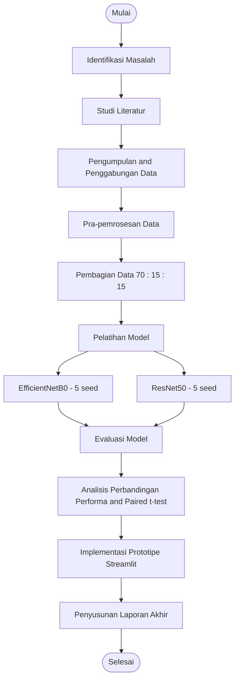

# Dokumentasi Proyek — Klasifikasi Kondisi Cuaca: EfficientNetB0 vs ResNet50

> Dokumen ini adalah dokumentasi teknis utama proyek (bukan bagian dari naskah skripsi). Ditulis untuk memberi gambaran scope, alur pengembangan, tools, dan output yang dihasilkan, mengacu penuh pada Proposal Penelitian yang sudah disetujui (khususnya BAB III dan Gambar 3.1).

## 1. Informasi Umum

| | |
|---|---|
| Judul TA | Analisis Perbandingan Model EfficientNetB0 dan ResNet50 pada Klasifikasi Kondisi Cuaca Berbasis Citra |
| Penulis TA | Mila Lestari (NPM 2208107010002) |
| Program Studi | Informatika, FMIPA, Universitas Syiah Kuala |
| Status akademik | Sudah Seminar Proposal. Revisi dari 3 dosen penguji (Pak Rasudin, Pak Irvanizam, Bu Kikye) ditangani **setelah** proyek teknis ini selesai |
| Dokumen acuan | Proposal Penelitian BAB I–III, khususnya Gambar 3.1 (Alur Metode Penelitian) |

## 2. Ruang Lingkup (Scope)

### 2.1 Termasuk dalam Scope
1. Persiapan & penggabungan dataset (2 sumber Kaggle → 5 kelas cuaca)
2. Pra-pemrosesan data (resize, normalisasi, augmentasi) — detail teknis disusun terpisah setelah dokumen ini
3. Pembagian data (stratified split 70:15:15)
4. Pelatihan 2 arsitektur (EfficientNetB0, ResNet50) × 5 seed = **10 run pelatihan**
5. Evaluasi model: metrik performa (akurasi, presisi, recall, F1-score) + metrik efisiensi (waktu inferensi, ukuran model, jumlah parameter)
6. Analisis statistik: paired t-test antar arsitektur
7. Implementasi prototipe aplikasi web (Streamlit)
8. Kode sumber lengkap, reproducible dan versioned di Git
9. Draf BAB IV (Hasil dan Pembahasan) dan BAB V (Kesimpulan dan Saran)

### 2.2 Ditangguhkan / Di Luar Dokumen Ini
- Detail teknis pra-pemrosesan (resize, penanganan format gambar, mapping nama kelas ke Bahasa Indonesia sesuai saran Pak Irvanizam) — didokumentasikan terpisah setelah dokumen ini selesai
- Revisi BAB I–III dari ketiga dosen penguji — dikerjakan setelah seluruh pipeline teknis selesai, tidak memengaruhi desain pipeline saat ini

## 3. Struktur Direktori Proyek

Repo: `TUGAS-AKHIR/`

```
TUGAS-AKHIR/
├── app/            # Prototipe aplikasi Streamlit
├── dataset/        # Dataset mentah & hasil penggabungan
├── doc/            # Dokumentasi proyek (termasuk file ini)
├── models/         # Checkpoint model hasil pelatihan
├── notebooks/      # Notebook eksperimen (Kaggle Notebook)
├── results/        # Output evaluasi: metrik, confusion matrix, hasil uji statistik
├── src/            # Kode sumber (preprocessing, training, evaluasi)
├── README.md
└── requirements.txt
```

## 4. Alur Metode Penelitian (Ref. Gambar 3.1 Proposal)

Sembilan tahapan berikut mengikuti alur yang telah ditetapkan pada Proposal (Gambar 3.1) dan menjadi acuan struktur pengembangan proyek ini:

1. Identifikasi Masalah
2. Studi Literatur
3. Pengumpulan dan Penggabungan Data
4. Pra-pemrosesan Data
5. Pembagian Data
6. Pelatihan Model (EfficientNetB0 & ResNet50, dilatih paralel/berurutan)
7. Evaluasi Model
8. Analisis Perbandingan Performa
9. Implementasi Prototipe Aplikasi (Streamlit)

### Diagram Alur (Activity Diagram Sederhana, notasi mirip UML)



Node oval (start/end) dan rectangle (proses) mengikuti konvensi umum UML Activity Diagram; fork pada tahap Pelatihan Model merepresentasikan dua arsitektur yang dilatih secara terpisah namun dengan konfigurasi identik, lalu menyatu kembali di tahap Evaluasi Model — sama seperti pada Gambar 3.1.

### Pemetaan Tahapan ke Struktur Repo

| Tahap | Lokasi di Repo |
|---|---|
| Pengumpulan & Penggabungan Data | `dataset/` |
| Pra-pemrosesan Data | `src/`, `notebooks/` |
| Pembagian Data | `src/`, `dataset/` (hasil split) |
| Pelatihan Model | `notebooks/` (Kaggle Notebook), `models/` (checkpoint) |
| Evaluasi Model | `results/` |
| Analisis Perbandingan Performa | `results/` |
| Implementasi Prototipe | `app/` |
| Dokumentasi | `doc/` |

## 5. Tools & Environment

Daftar berikut mengikuti perangkat lunak pada Proposal BAB 3.2.2, dengan penyesuaian praktis untuk kebutuhan eksekusi:

| Tools | Versi (sesuai proposal) | Keterangan |
|---|---|---|
| Python | 3.10.12 | Versi acuan proposal; environment aktual mengikuti versi yang tersedia di Kaggle Notebook / lokal |
| TensorFlow | 2.20.0 | Framework utama training model |
| NumPy | 1.26.4 | Komputasi numerik |
| Pandas | 2.2.2 | Manipulasi data tabular (metrik, log eksperimen) |
| Matplotlib | 3.9.2 | Visualisasi (grafik pelatihan, perbandingan) |
| Seaborn | 0.13.2 | Visualisasi statistik (confusion matrix, dsb.) |
| Scikit-learn | 1.5.2 | Split data, metrik evaluasi, uji statistik |
| Pillow (PIL) | 10.4.0 | Pemrosesan citra |
| Kaggle API | 1.6.17 | Unduh/kelola dataset |
| Streamlit | 1.38.0 | Aplikasi prototipe berbasis web |

**Catatan penyesuaian dari proposal:**

- **Sistem Operasi** — Proposal mencantumkan Windows 11 Pro; environment pengembangan aktual menggunakan **Arch Linux**. Ini murni formalitas dokumen dan tidak memengaruhi validitas hasil, karena seluruh proses training dijalankan di platform cloud, bukan di mesin lokal.
- **Platform training** — Proposal awalnya menyebut Google Colaboratory (GPU Tesla T4). Rencana revisi teknis: berpindah ke **Kaggle Notebook dengan GPU T4×2**. Perubahan ini murni infrastruktur eksekusi — arsitektur, hyperparameter, dan callback tetap identik dengan yang ditulis di proposal.

## 6. Strategi Eksperimen

### 6.1 Desain Run
- 2 arsitektur (EfficientNetB0, ResNet50) × 5 variasi seed = **10 run pelatihan total**
- Setiap run memvariasikan **seed pembagian data (split)** dan **seed inisialisasi bobot** secara bersamaan. Artinya, run ke-*i* pada EfficientNetB0 dan run ke-*i* pada ResNet50 memakai split data yang identik — menjamin pasangan data yang valid dan adil untuk `scipy.stats.ttest_rel` (paired t-test) pada tahap Analisis Perbandingan Performa.

### 6.2 Strategi Checkpoint Model
- **Seluruh 10 checkpoint** (2 arsitektur × 5 seed) disimpan di `models/` untuk keperluan analisis statistik dan reproduktibilitas, mendukung `ModelCheckpoint(save_best_only=True)` per run.
- Untuk **aplikasi Streamlit**, hanya **satu model terbaik secara keseluruhan** (dari 10 run, arsitektur mana pun yang unggul berdasarkan hasil analisis perbandingan) yang di-deploy — konsisten dengan Proposal BAB 3.3.9 yang menyebutkan "model terbaik hasil perbandingan diintegrasikan ke dalam prototipe aplikasi".

## 7. Output yang Dihasilkan (Deliverables)

| Output | Lokasi | Deskripsi |
|---|---|---|
| Kode sumber lengkap | `src/`, `notebooks/` | Skrip preprocessing, training, evaluasi; notebook eksperimen Kaggle |
| 10 checkpoint model | `models/` | Bobot terbaik per run (5 seed × 2 arsitektur) |
| 1 model produksi | `models/` (subset) | Model terbaik keseluruhan, dipakai oleh `app/` |
| Metrik evaluasi | `results/` | Akurasi, presisi, recall, F1-score (per run & rata-rata), confusion matrix |
| Metrik efisiensi | `results/` | Waktu inferensi, ukuran model, jumlah parameter |
| Hasil uji statistik | `results/` | Output paired t-test (nilai t, p-value) antar arsitektur |
| Aplikasi prototipe | `app/` | Aplikasi Streamlit untuk klasifikasi cuaca dari citra unggahan |
| Draf BAB IV & V | `doc/` | Narasi hasil dan pembahasan, kesimpulan & saran, siap diadaptasi ke skripsi |
| Dokumentasi proyek | `doc/documentation.md` | Dokumen ini |

## 8. Catatan & Asumsi

- Detail teknis pra-pemrosesan (ukuran, format file, mapping nama kelas ke Bahasa Indonesia) akan didokumentasikan pada tahap berikutnya, terpisah dari dokumen ini.
- Ketiga poin revisi dari dosen penguji dicatat sebagai pekerjaan lanjutan pasca-proyek teknis ini dan tidak memengaruhi desain pipeline yang dijelaskan di atas.
- Dokumen ini akan diperbarui seiring progres tiap tahapan pada Bagian 4.

---
*Versi dokumen: 0.1 — 9 September 2026*
